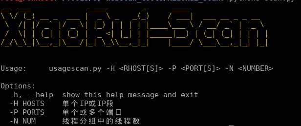
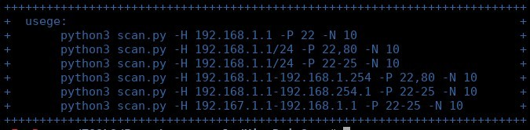
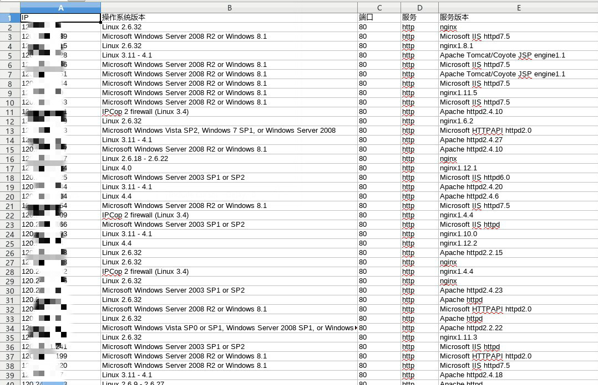

# XiaoRui-Scan

​	工具用时方恨少，满足要求少又少。
​	接了一个锅：进行互联网大网段的端口服务指纹识别。

​	单单只用nmap进行端口服务指纹识别的速度伤人，效率低得太多。于是搞了这个轮子。

​	提速思路，先用masscan（传说三分扫全网）进行端口快速扫描，这么一来就过滤出了哪些IP开放了哪些端口，再用多线程弄个nmap对masscan的扫描结果进行端口服务指纹识别。

​	测试一下后，速度提升灰常大。机器好、网速好的同学，可以极限测试一下。

运行环境：

linux、python3

基本功能：

1. 支持多端口、多IP扫描。
2. 支持端口服务指纹识别。
3. 支持系统指纹识别。
4. 支持扫描结果统计与保存。

使用参数：-H 指定扫描的IP，-P指定扫描的端口，-N指定多线程分组的线程数（依据机器性能和网速调整，大网段下-N越大速度越快，反之越慢。）

支持的扫描格式：

结果保存excel：

注：masscan为64位，32位系统上替换masscan为32位即可。运行前需要用命令`chmod +x masscan`赋予执行权限。
